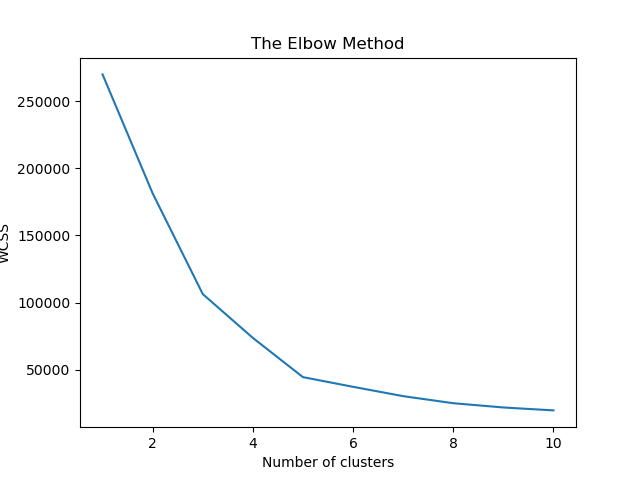
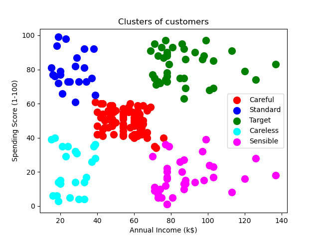
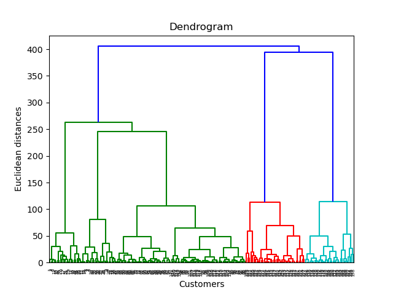
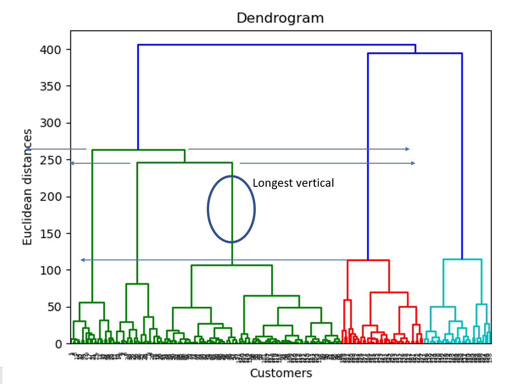
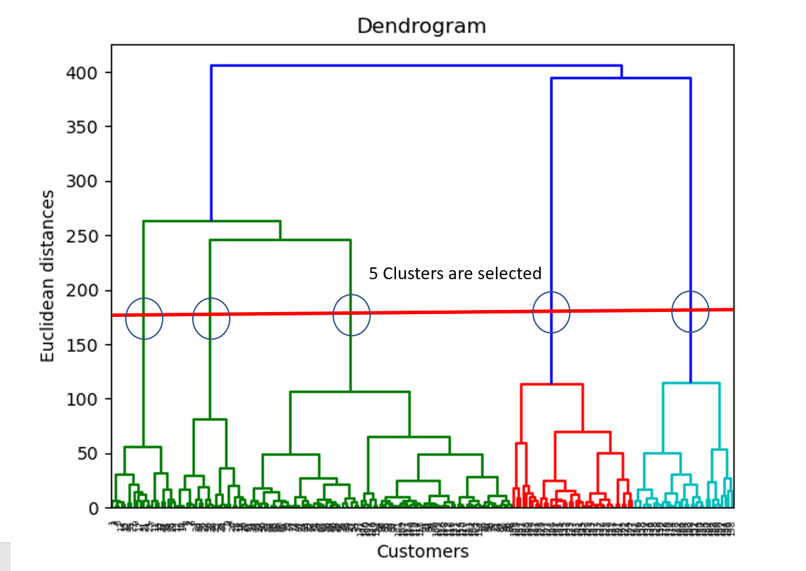
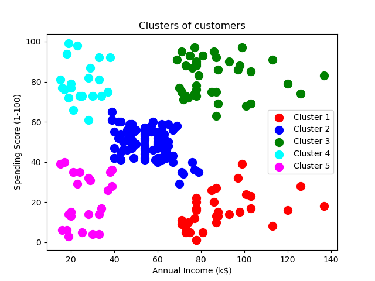

# Project Description

Given a customer dataset collected by a strategy team of a mall. (CustomerID, Gender, Age, Annual Income, Spending Score (1-100)

The goal is to understand and identify the customers with some patterns based on this data. 

Two clustering methods were used to categorized the customers.

## K-Means Clustering
Before jumped into applying kmeans clustering to this dataset. We need to utlize elbow method to find the optimal number of clusters. 

Number of clusters tested were from 1 to 10. The within-cluster sum of squares were calculated for 10 different number of clusters.

Viewing the wcss value generated, we can identify the optimal number of cluster is 5.

Applying the k-means clustering to the dataset we can categorize the customers to 5 groups. The customers from the target group are target customers the marketing team should focus on.

## Hierarchical Clustering

### Agglomerative HC steps
1. Make each data point a single-point cluster -> forms N clusters
2. Take the two closest data points and make them one cluster -> forms N-1 clusters
3. Take the two closest clusters and make them one cluster -> forms N-2 clusters
4. Repeat Step 3 until there is only 1 cluster

For distance here I used Euclidean distance for this problem. 

This process is stored in a dendrogram, which later be used to find the optimal number of clusters. The y axis is the euclidean distances between 2 clusters.

The way to determine the optimal number of clusters, we can look at the longest vertical line that is not crossed by any horizontal line "extended".

Once the longest vertical line of distance has been found, we can use this to determine the optimal number of clusters

Once we have our dendrogram ready and number of clusters determined. We can train/build the Hierarchical Clustering model to determine the clusters each customers belongs to.

### Voilà! We now successfully using hierarachical clustering and k-means clustering process to determined the groups of customers.

By comparison both K-means and Hierarchical Clustering showed pretty simlar results. With this results, the marketing team can focus on those target customers for their new product launch!

