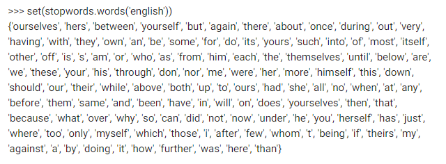
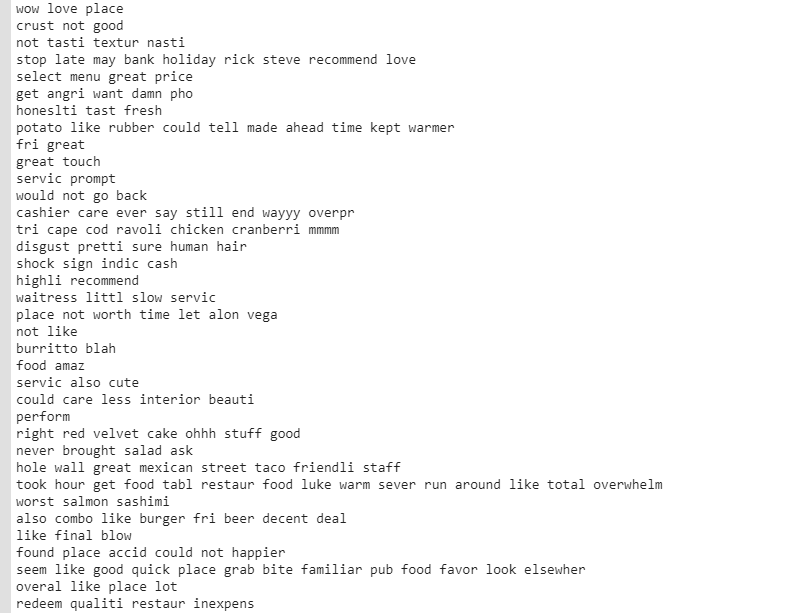
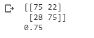

# Project Description

In this project, we're trying to deploy a machine learning model applying Naive Bayes Classifier to identify whether a review of a restaurant is positive or not. 

## Cleaning the texts

Before applying the Naive Bayes Classifier, we need to clean up the texts. 

This consists of 4 parts:

1. Remove non-alphabetic characters
We first need to remove non-alphabetic characters like comma, Exclamation mark or Question mark etc. These are not going to be useful to determine nature of the review

2. Change all characters to lowerase
We don't need to seperate Good from good. So changing all words to lowercase

3. Remove stopwords
There are words not really useful to determine the review is positive or negative, for example: you, he, she etc. So we can remove them. I utilized the nltk stop words library for this. 

One tiny changes I made is not to remove the word "not". Although "not" is in the stop words libraray but I believe it holds meaningful information for my project.

4. Stemming
Lastly, we need to remove conjugation of verbs. There's no need to separate love from loved or anything with different verb tenses.

After clean up the words, I derived the following word samples.

The model eventually reach 75% accuracy by confusion matrix

