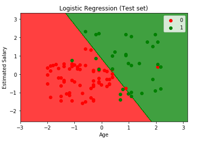

# Project Description

Given a dataset contains information of 400 users in a social network. (User ID, Gender, Age, Estimated Salary, Purchased history with your client)

The goal is to set up a machine learning model to target new users who are more likely to buy the product from your client. 

Three classification techniques were tried separately and the models' performance were validated.

## Logistic Regression
First we try it out with logistic regression. A linear classification model. We split the data to 300 training set and 100 test set.

We can see the dataset can be roughly separate by a line (users are more likely be a costomer with higher income or older). But there are still some data points that are impossible to catch based on the logistic regression model.

 

### Confusion Matrix
We reached 89% accuracy with logistic regression on the test set. Next we will try to improve it by using a non linear classifier

## Kernel SVM 

Now we can see this problem is more like a non-linear problem. We would implement a non-linear model to try to improve the accuracy, Kernel SVM. The algorithm I chose here is a Gaussian kernel which I think will be perfect to improve our accuracy!

The following are the results we run our model with Kernel SVM! And I was excited to to see the new model we trained separate the dataset better than our linear regression model!

 

### Confusion Matrix
This model reached 93% accuracy with the test set! Can we do better? I would like to run another non-linear model with Random Forest algorithm to see if we can beat 93%!

## Random Forest

Even though it is also a non-linear classifier, we can visualize the way it perform classification is different from Kernel SVM!

 

### Confusion Matrix

We got 92% accuracy which didn't beat the kernel SVM method with this test set. But still better than logistic regression!

# Future improvments

1. Can apply k-fold cross validation to validate the model performance
2. Use grid search to find the better model for this problem

